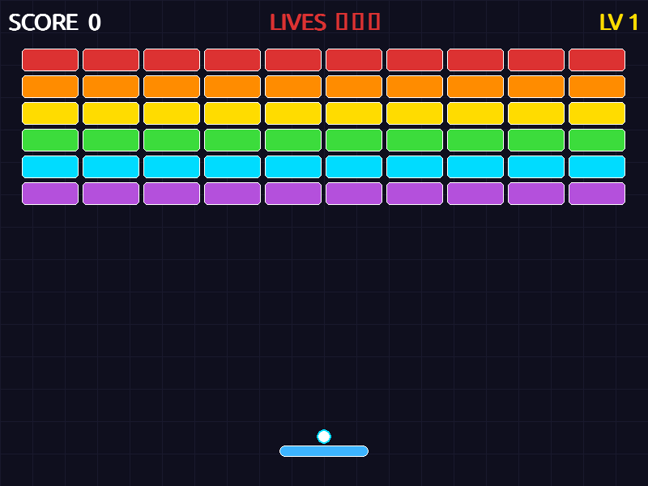

# Block Breaker Game 🎮

클래식 블록 뿌시기 게임 — Python + Pygame



## 실행 방법

```bash
pip install pygame
python3 game.py
```

## 조작법

| 키 | 동작 |
|---|---|
| 마우스 이동 | 패들 조작 |
| ← → 방향키 | 패들 조작 |
| R | 재시작 |
| ESC | 종료 |

## 게임 특징

- **3개 레벨** — 레벨이 올라갈수록 내구도 높은 블록 등장
- **콤보 시스템** — 연속으로 블록을 깨면 점수 배수 증가
- **각도 조절** — 패들의 어느 위치에 맞았냐에 따라 공 방향 변화
- **파티클 이펙트** — 블록 파괴 시 색상 파티클 폭발
- **목숨 3개** — 공을 놓치면 목숨 차감

## 기술 스택

- Python 3
- Pygame 2.x
